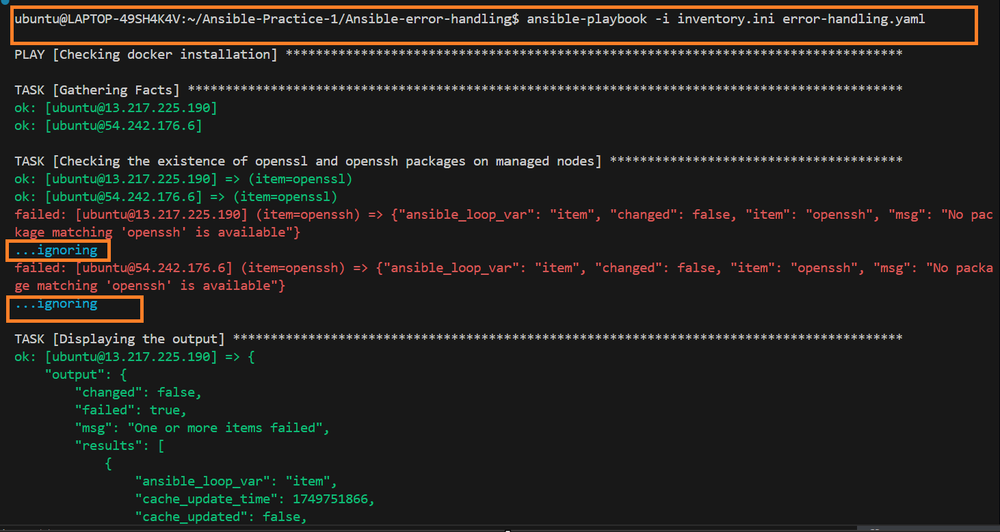
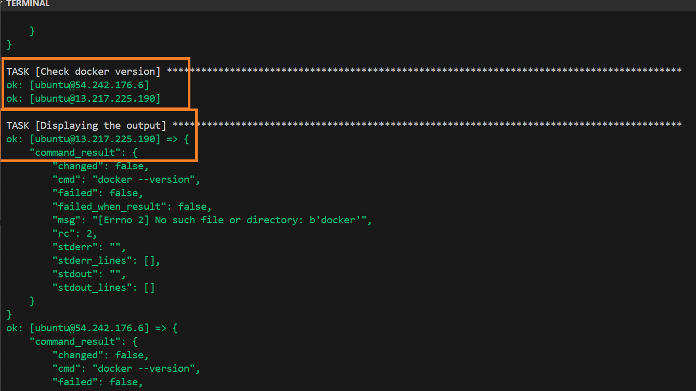
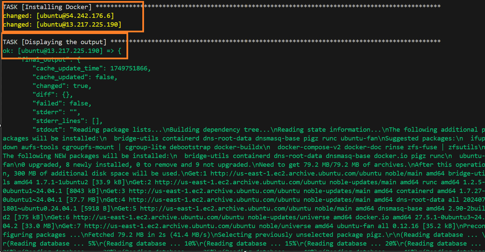
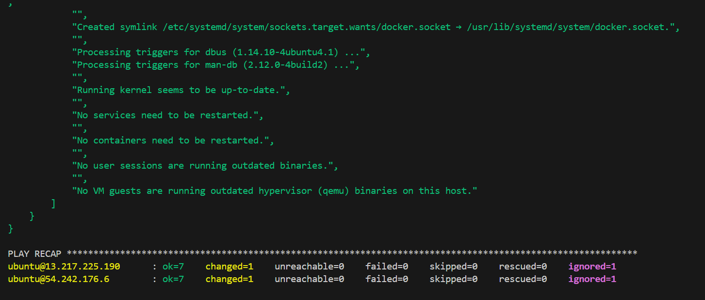
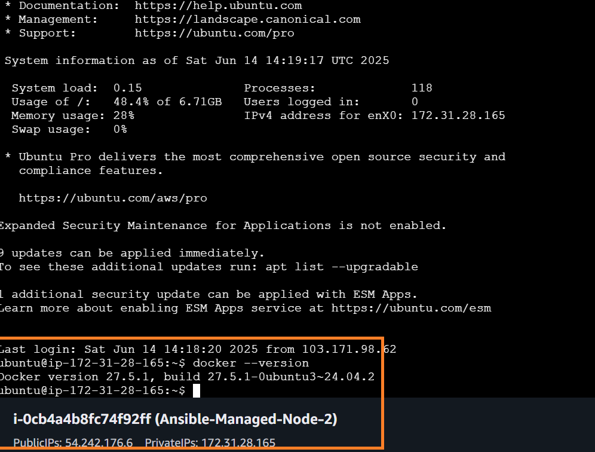
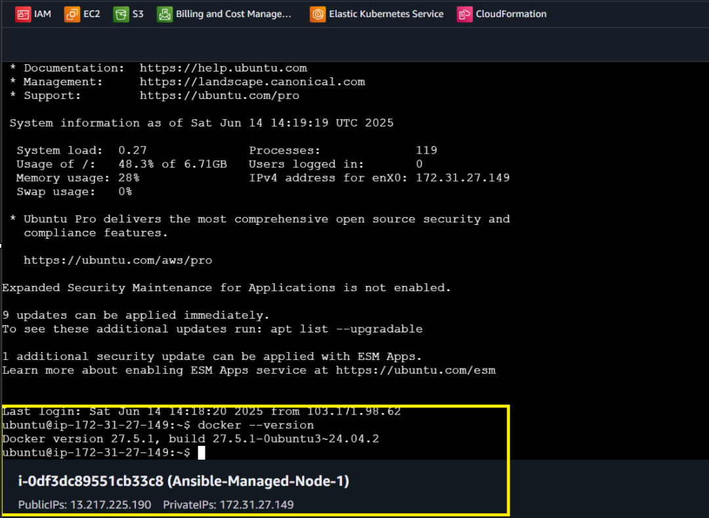

## Error handling in Ansible.

## Reference Docs

- [Ansible Error Handling Guide](https://docs.ansible.com/ansible/latest/playbook_guide/playbooks_error_handling.html)
- [Ansible Loops Guide](https://docs.ansible.com/ansible/latest/playbook_guide/playbooks_loops.html)
- [Ansible Variables Guide](https://docs.ansible.com/ansible/latest/playbook_guide/playbooks_variables.html)
- [Ansible Debug Module](https://docs.ansible.com/ansible/latest/collections/ansible/builtin/debug_module.html)
- [Ansible Conditionals Guide](https://docs.ansible.com/ansible/latest/playbook_guide/playbooks_conditionals.html)

## Command used.

ansible-playbook -i inventory.ini error-handling.yaml 
## Outcomes of hands-on

---

- 
- 
- 
- 
- 
- 

---