# Ansible Galaxy Guide

## 📚 Reference Documentation

- [Ansible Galaxy UI](https://galaxy.ansible.com/ui/)
- [Ansible Galaxy User Guide](https://docs.ansible.com/ansible/latest/galaxy/user_guide.html)
- [bsmeding.docker Role Documentation](https://galaxy.ansible.com/ui/standalone/roles/bsmeding/docker/documentation/)
- [Ansible custom role published here](https://github.com/khannashiv/Ansible-galaxy-practice)

---

## 🚀 Sample Commands

```sh
ansible-galaxy -h
ansible-galaxy role -h
ansible-galaxy collection -h
ansible-galaxy role install bsmeding.docker
```
---

## 🐳 Demo: Installing an Ansible Role from Galaxy

This demo shows how to install the `bsmeding.docker` role from Ansible Galaxy and use it to install Docker on managed nodes.

- The role supports installing Docker on different Linux distributions.
- [Role Install URL](https://galaxy.ansible.com/ui/standalone/roles/bsmeding/docker/install/)
- **Install command:**
  ```sh
  ansible-galaxy role install bsmeding.docker
  ```
- Roles are installed by default to:  
  `/root/.ansible/roles`
- To execute the role, use the provided playbook:  
  `docker-playbook.yaml` (which references the `bsmeding.docker` role)  
  **Run the playbook:**
  ```sh
  ansible-playbook -i inventory.ini docker-playbook.yaml
  ```

---

## 📦 Publishing a Custom Ansible Role to Ansible Galaxy

1. **Move your Ansible role to GitHub** (from the Ansible controller where you deployed role via Ansible Galaxy CLI):

   ```sh
   cd <your-ansible-role-directory>
   git init
   git add .
   git commit -m "first commit"
   git branch -M main
   git remote add origin https://github.com/khannashiv/Ansible-galaxy-practice.git
   git push -u origin main
   ```

2. **Import the role to Ansible Galaxy from GitHub:**

   - General command:
     ```sh
     ansible-galaxy import <github_user> <github_repo> --token <Value-of-token>
     ```
   - Example:
     ```sh
     ansible-galaxy import khannashiv Ansible-galaxy-practice --token <Value-of-token>
     ```

---

## 📝 Outcomes of Hands-on

| Step | Screenshot |
|------|------------|
| 1    | 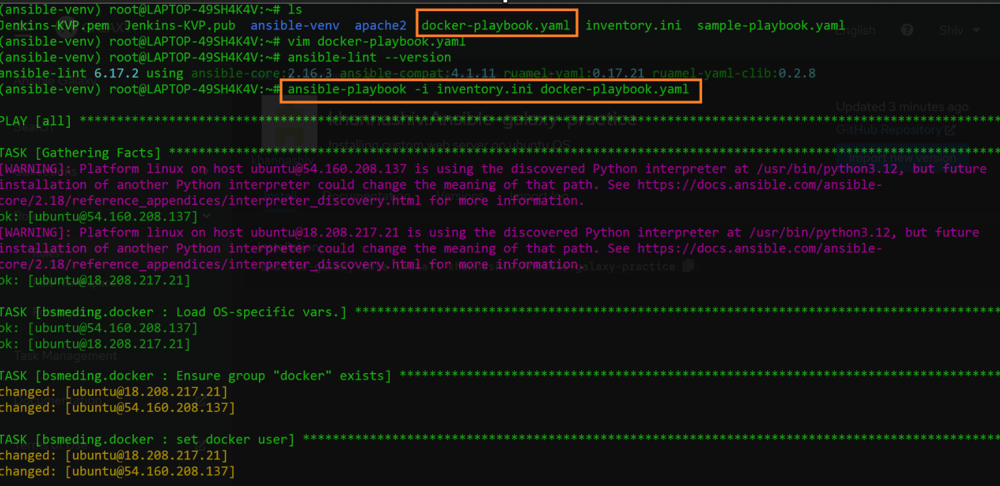 |
| 2    | 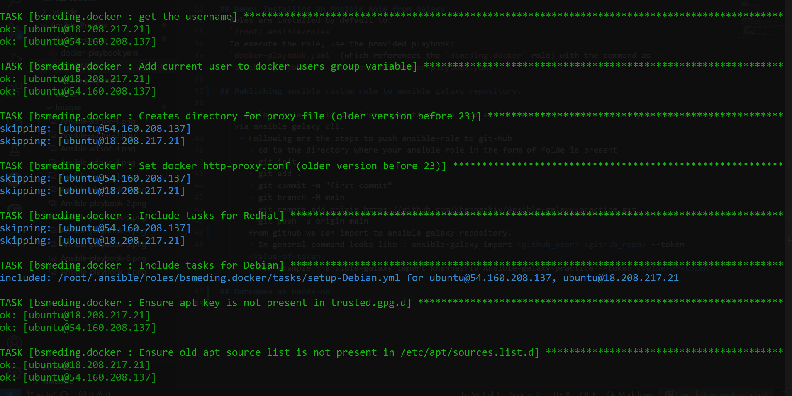 |
| 3    | 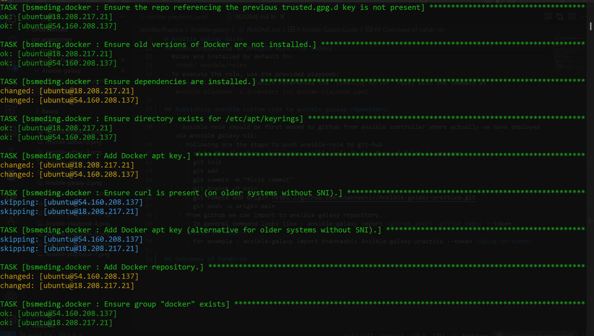 |
| 4    | 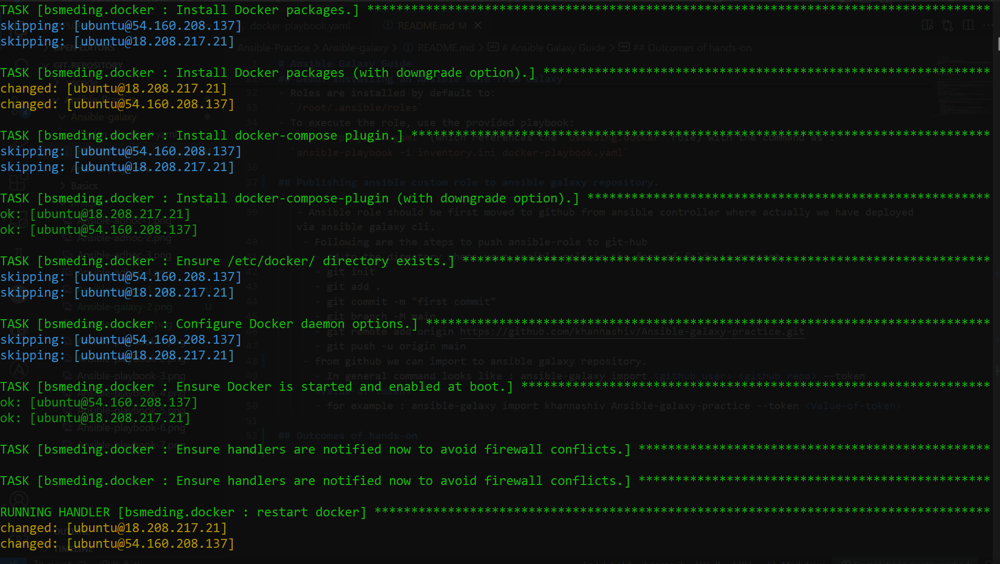 |
| 5    | 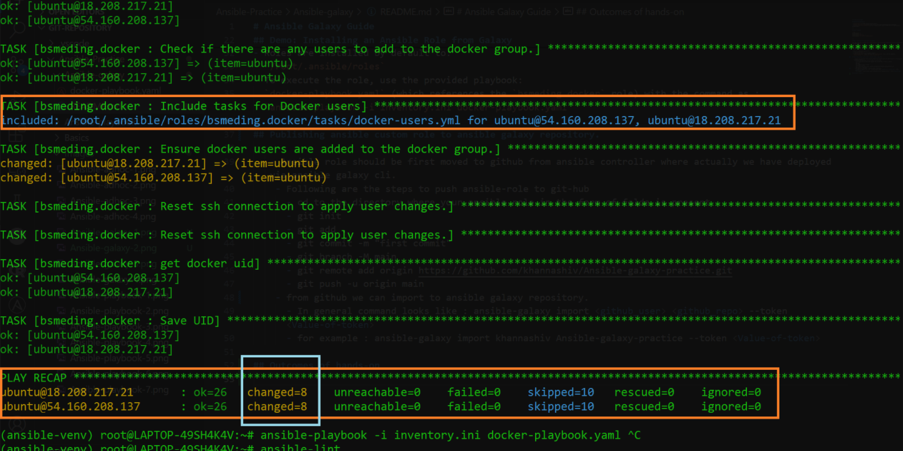 |
| 6    | 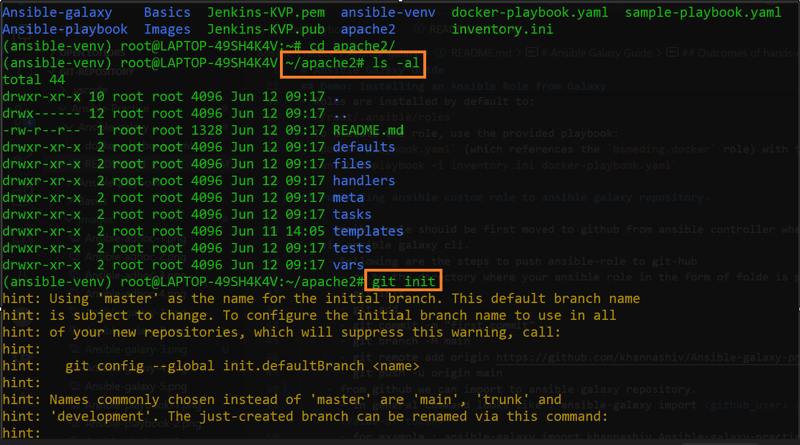 |
| 7    | 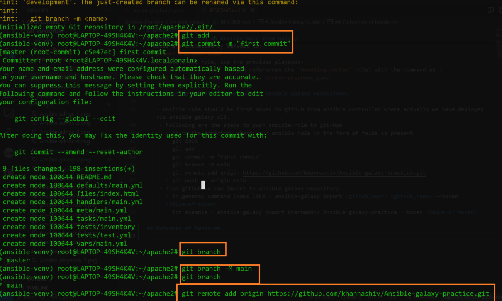 |
| 8    | 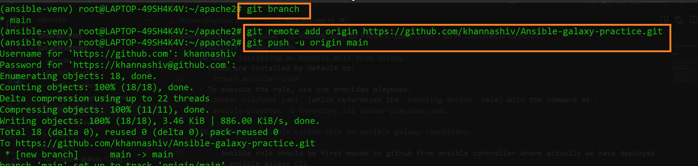 |
| 9    | 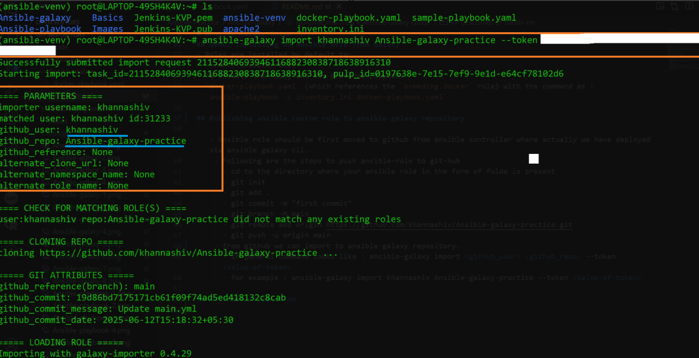 |
| 10   | 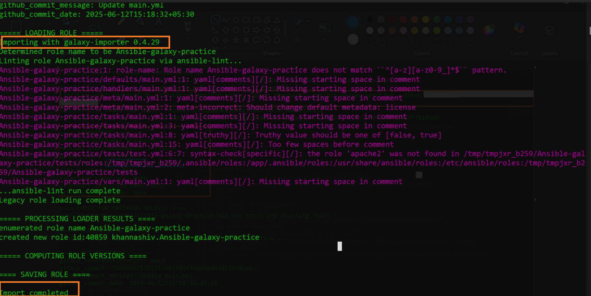 |
| 11   | 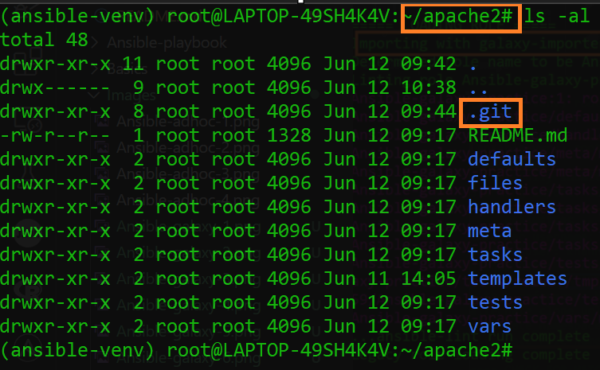 |
| 12   | 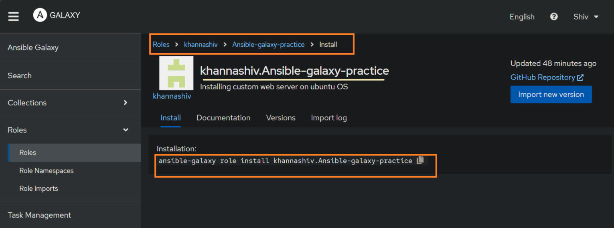 |
| 13   | 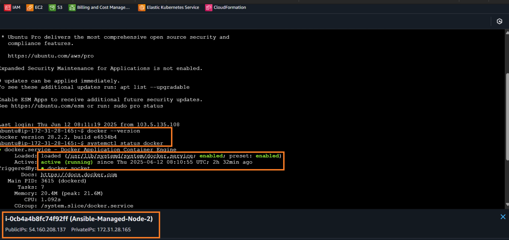 |
| 14   | 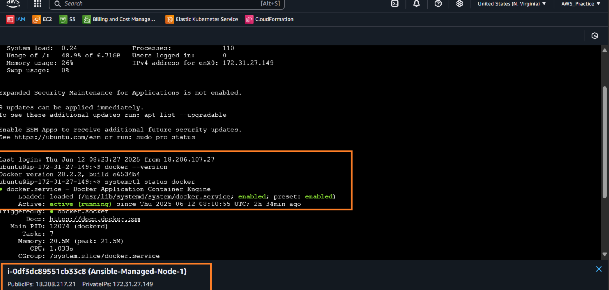 |