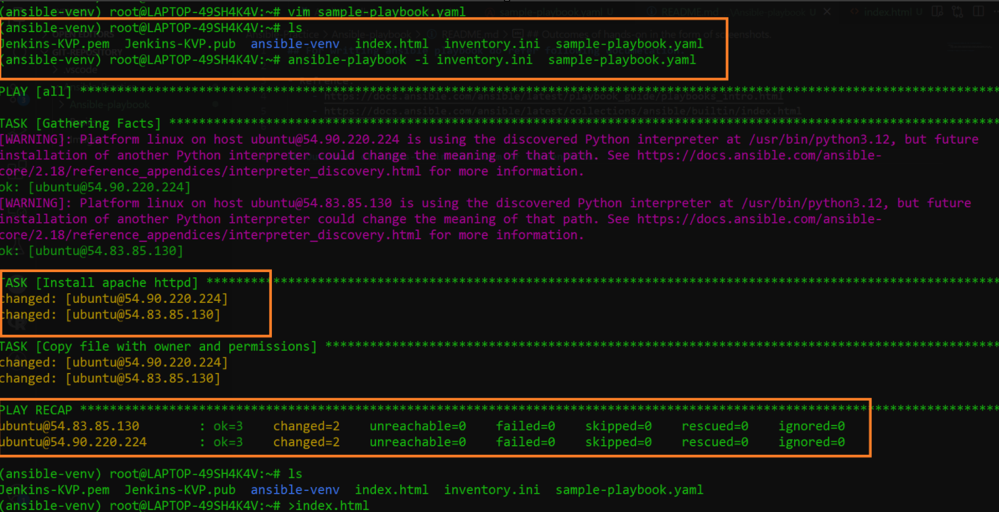
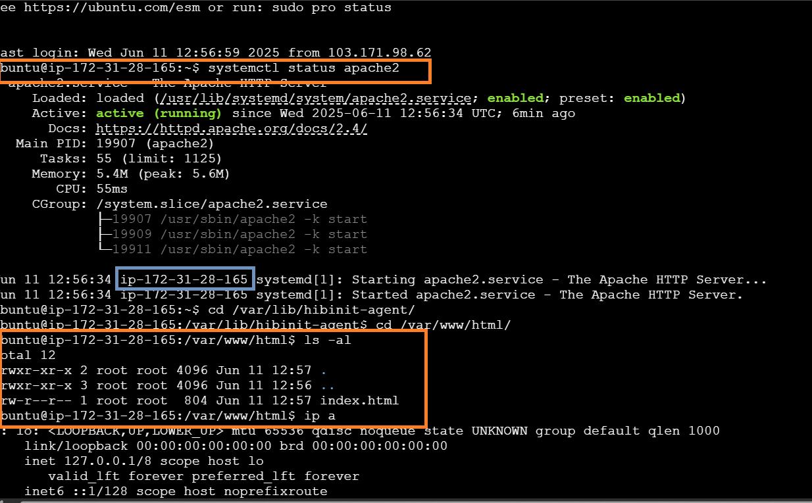
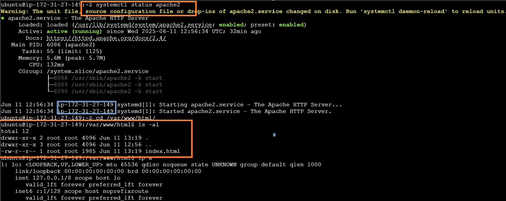
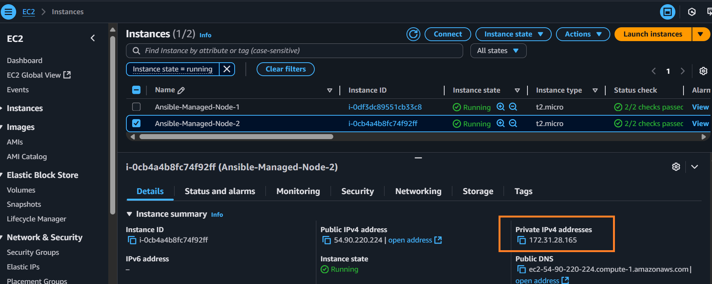
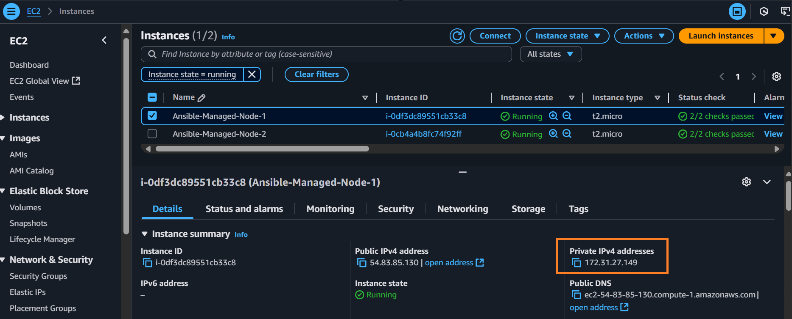
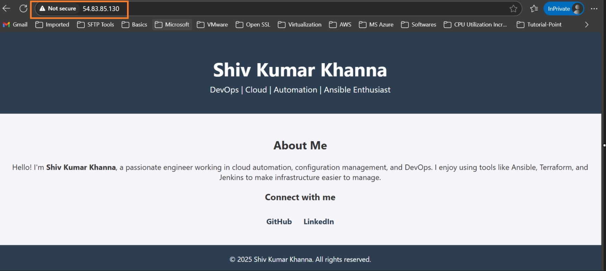
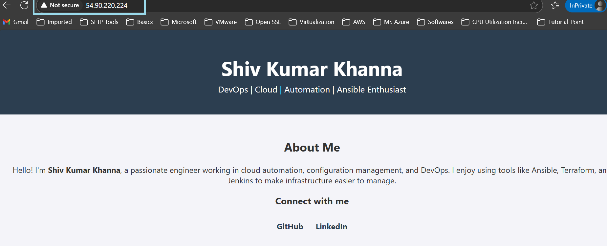

# Ansible Playbook Guide

## Reference Documentation

- [Ansible Playbooks Introduction](https://docs.ansible.com/ansible/latest/playbook_guide/playbooks_intro.html)
- [Ansible Built-in Collections](https://docs.ansible.com/ansible/latest/collections/ansible/builtin/index.html)

### Learning & Practice Resources
- [Ansible Zero to Hero GitHub Repository](https://github.com/iam-veeramalla/ansible-zero-to-hero)

---

## Outcomes of Hands-On Practice

Below are screenshots showcasing the outcomes from running various Ansible playbooks:

- 
- 
- 
- 
- 
- 
- 