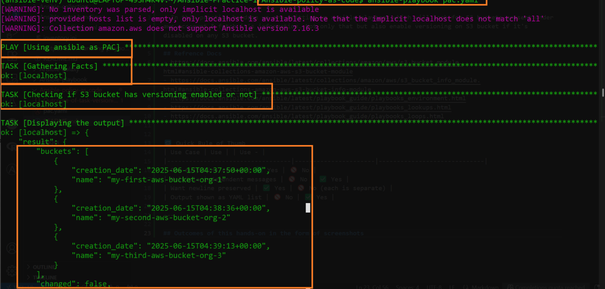
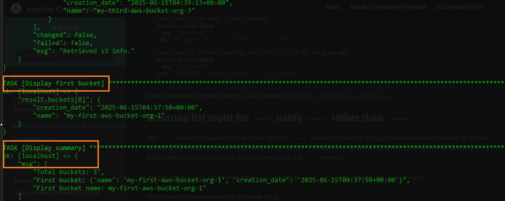
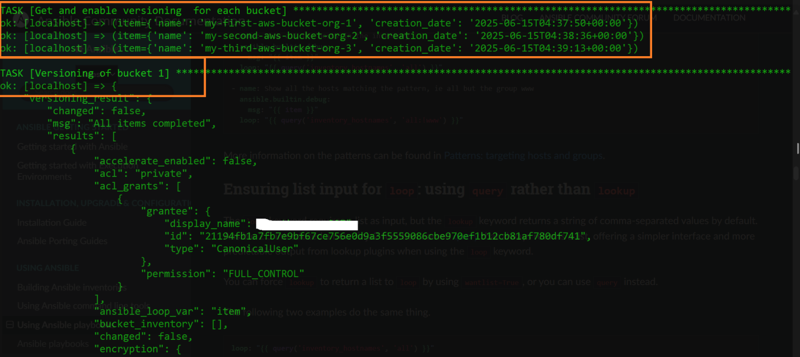
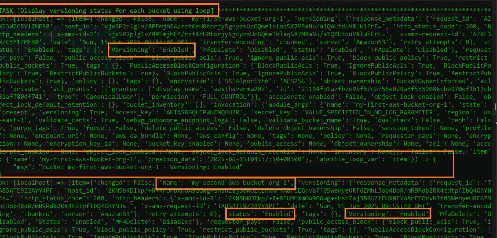
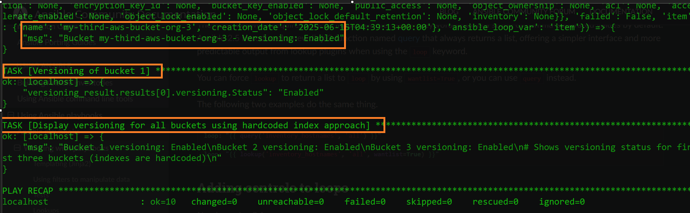
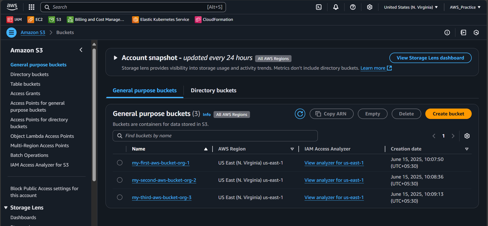
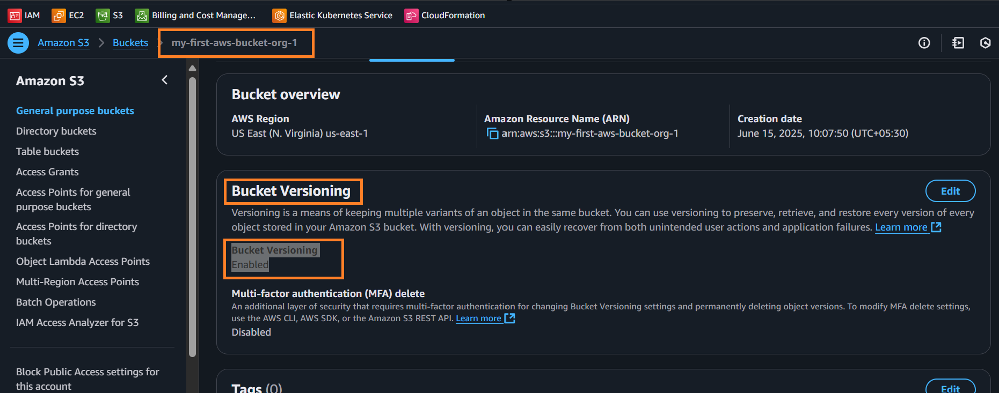
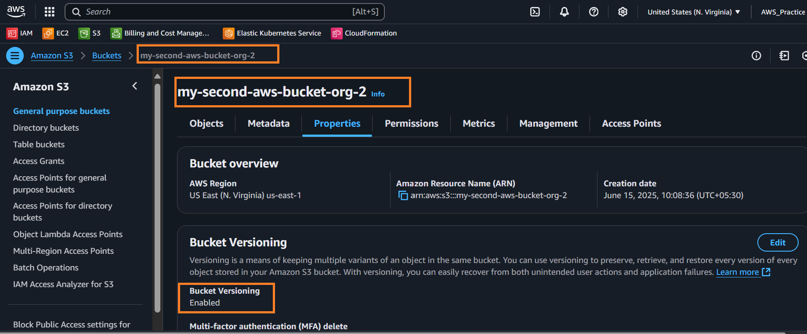
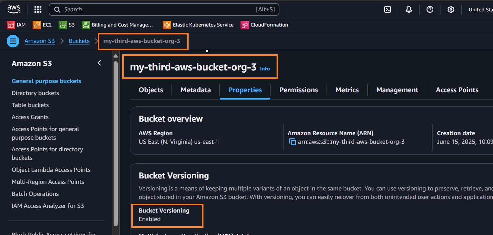

# Using Ansible as Policy as Code

In this hands-on practice, we are writing an Ansible playbook which will:
- Discover S3 buckets present in an AWS account and fetch their information.
- Enable versioning on S3 buckets if not already enabled.

---

## Prerequisites

- Python and [Ansible](https://docs.ansible.com/ansible/latest/installation_guide/intro_installation.html) installed.
- AWS CLI installed and configured with credentials having permissions for `s3:ListBucket`, `s3:GetBucketVersioning`, and `s3:PutBucketVersioning`.

---

## Setup Instructions

1. **Clone this repository** and navigate to the `Ansible-policy-as-code` directory.
2. (Recommended) Create and activate a Python virtual environment:
   ```bash
   python3 -m venv ansible-venv
   source ansible-venv/bin/activate
   ```
3. **Install Ansible and dependencies:**
   ```bash
   pip install ansible boto3 botocore
   ```
4. **Configure your AWS credentials:**
   ```bash
   aws configure
   ```
   or set environment variables: `AWS_ACCESS_KEY_ID`, `AWS_SECRET_ACCESS_KEY`, `AWS_DEFAULT_REGION`.

---

## Reference Docs

- [Ansible aws_s3_bucket Module](https://docs.ansible.com/ansible/latest/collections/amazon/aws/s3_bucket_module.html#ansible-collections-amazon-aws-s3-bucket-module)
- [Ansible aws_s3_bucket_info Module](https://docs.ansible.com/ansible/latest/collections/amazon/aws/s3_bucket_info_module.html#ansible-collections-amazon-aws-s3-bucket-info-module)
- [Ansible Playbook Guide: Environment](https://docs.ansible.com/ansible/latest/playbook_guide/playbooks_environment.html)
- [Ansible Playbook Guide: Lookups](https://docs.ansible.com/ansible/latest/playbook_guide/playbooks_lookups.html)
- [Ansible Playbook Guide: Loops](https://docs.ansible.com/ansible/latest/playbook_guide/playbooks_loops.html)
- [Ansible Zero to Hero (GitHub)](https://github.com/iam-veeramalla/ansible-zero-to-hero)

---

## Playbook Overview

- The playbook (`pac.yaml`) will:
  - Collect a list of all S3 buckets in your AWS account.
  - Fetch information for each bucket.
  - Enable versioning where it is not already enabled.
- Variables can be set in a `vars` section or an external vars file if needed.

---

## Command Used

```bash
(ansible-venv) ubuntu@LAPTOP-49SH4K4V:~/Ansible-Practice-1/Ansible-policy-as-code$ ansible-playbook pac.yaml
```

---

## 🔁 Quick Rule of Thumb while Choosing between | and - after msg: block

<table>
    <thead>
        <tr>
            <th>Use Case</th>
            <th>Use <code>|</code> (Literal Block)</th>
            <th>Use <code>&gt;-</code> (Folded Block)</th>
        </tr>
    </thead>
    <tbody>
        <tr>
            <td>One multiline string</td>
            <td style="text-align:center;">✅ Yes</td>
            <td style="text-align:center;">🚫 No</td>
        </tr>
        <tr>
            <td>Multiple independent messages</td>
            <td style="text-align:center;">🚫 No</td>
            <td style="text-align:center;">✅ Yes</td>
        </tr>
        <tr>
            <td>Want newline preserved</td>
            <td style="text-align:center;">✅ Yes</td>
            <td style="text-align:center;">🚫 No</td>
        </tr>
        <tr>
            <td>Output shown as YAML list</td>
            <td style="text-align:center;">🚫 No</td>
            <td style="text-align:center;">✅ Yes</td>
        </tr>
    </tbody>
</table>

---

## Outcomes of this Hands-on (Screenshots)

- 
- 
- 
- 
- 
- 
- 
- 
- 
---

## Troubleshooting / Common Issues

- **Missing AWS permissions:** Check your IAM role/policy for required S3 permissions.
- **No buckets found:** Ensure you are in the correct AWS region and have the necessary permissions.
- **Module not found:** Ensure `boto3` and `botocore` are installed and accessible in your Python environment.

---

## Author

- [khannashiv](https://github.com/khannashiv)
