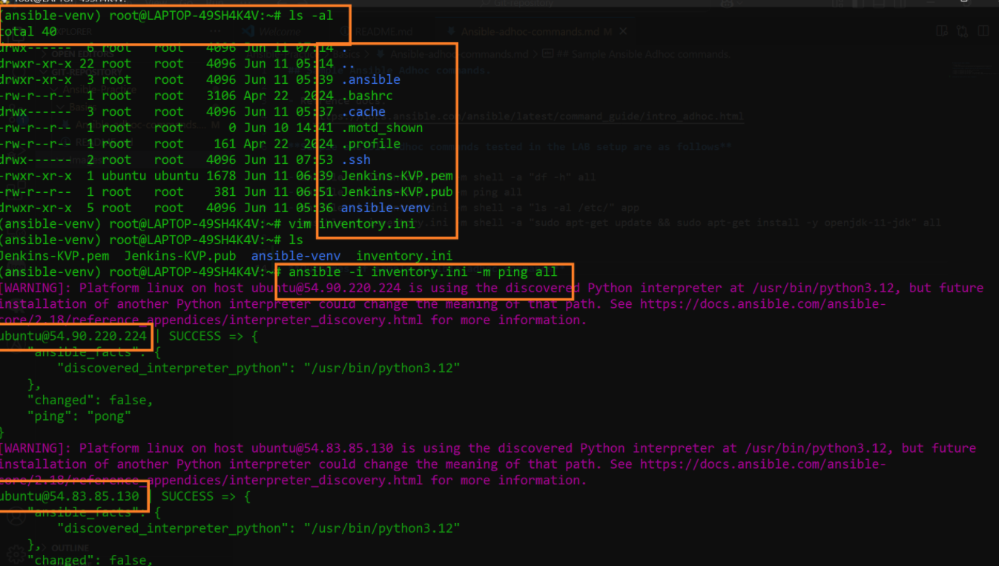
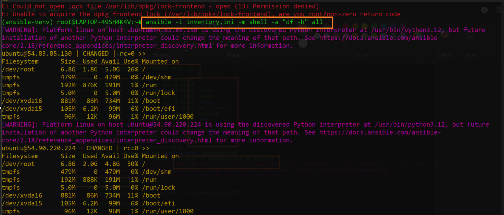
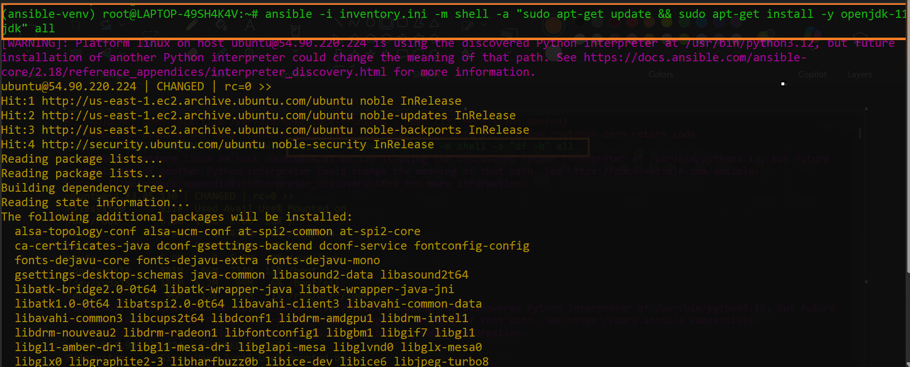
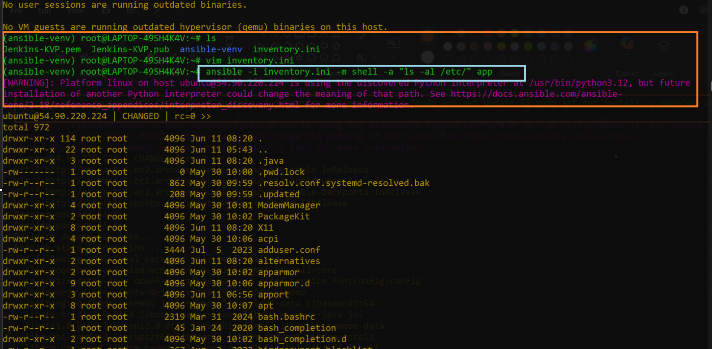

## Sample Ansible Adhoc commands.

- Refrence docs.
  - https://docs.ansible.com/ansible/latest/command_guide/intro_adhoc.html

**Sample ansible adhoc commands tested in the LAB setup are as follows**

- ansible -i inventory.ini -m shell -a "df -h" all
- ansible -i inventory.ini -m ping all
- ansible -i inventory.ini -m shell -a "ls -al /etc/" app
- ansible -i inventory.ini -m shell -a "sudo apt-get update && sudo apt-get install -y openjdk-11-jdk" all

**Outcomes of sample ansible adhoc commands**

- 
- 
- 
- 