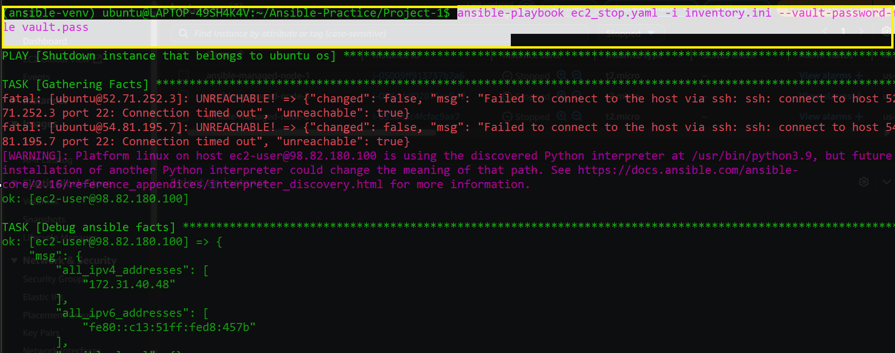

# Ansible Realtime project

## Task 1

Create three(3) EC2 instances on AWS using Ansible loops
- 2 Instances with Ubuntu Distribution
- 1 Instance with Centos Distribution

Hint: Use `connection: local` on Ansible Control node.

## Task 2

Set up passwordless authentication between Ansible control node and newly created 
instances.

## Task 3

Automate the shutdown of Ubuntu Instances only using Ansible Conditionals

Hint: Use `when` condition on ansible `gather_facts`

## Refrence Docs

- [Ansible Playbooks: Variables and Facts](https://docs.ansible.com/ansible/latest/playbook_guide/playbooks_vars_facts.html)

## Outcomes of Hands-on for Project-1

---

- 
- 
- 
- 
- 

---